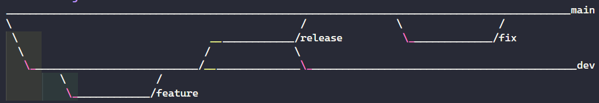

## type d'écriture

Camel Case : maFonctionADeclarer
Pascal Case: MaFonctionADeclarer
Snake Case : ma_fonction_a_declarer

## branche git

### CRUD

Create : créer
Read : lire
Update : mettre à jour
Delete : supprimer
